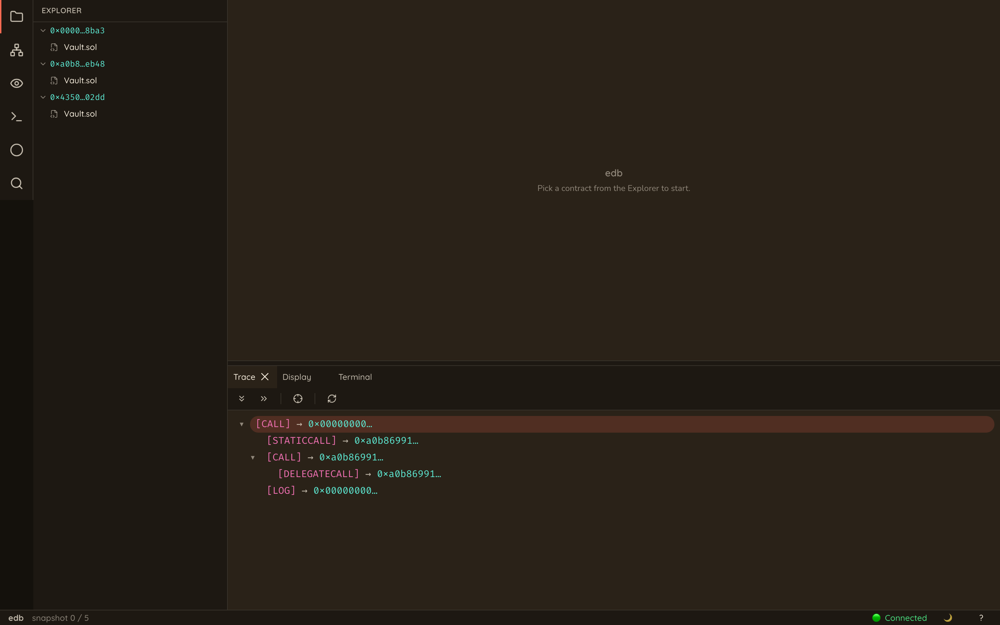
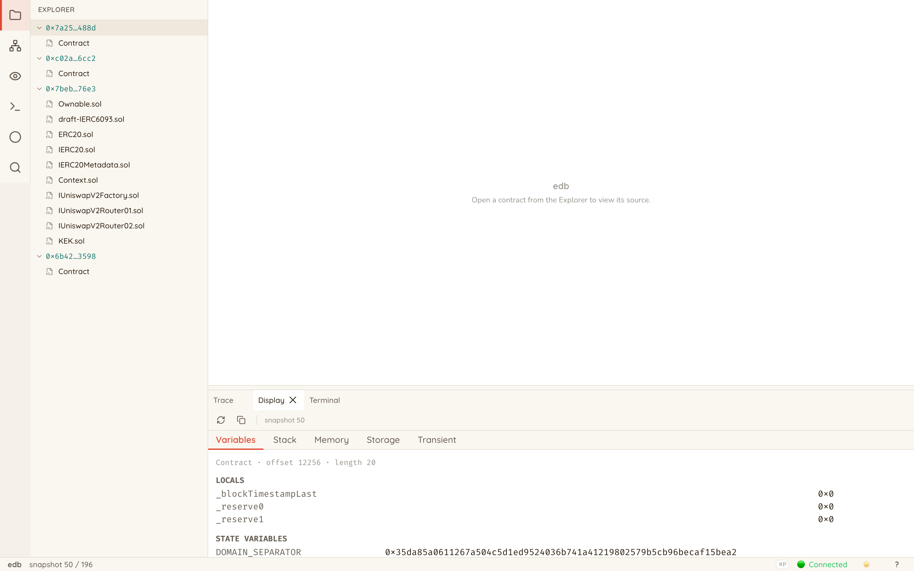

<h1 align="center">
  EDB 
  &nbsp;·&nbsp; The Ethereum Project Debugger
</h1>

<p align="center">
  <strong>To our knowledge, the first Ethereum smart-contract debugger that can theoretically achieve 100% accurate source-to-bytecode mapping.</strong>
</p>

<p align="center">
  Source-level time-travel debugger for Ethereum smart contracts.
</p>

<p align="center">
  <a href="#installation"></a>
  <a href="#quickstart"></a>
  <a href="https://edb.zzhang.xyz"></a>
  <a href="#why-edb"></a>
  <a href="#sponsors"></a>
  <a href="https://t.me/edb_feedback"></a>
</p>

EDB bridges the gap between high-level Solidity code and low-level EVM execution, providing four essential debugging features that have been missing from the Ethereum ecosystem:

- 🧭 **Step-by-step execution at the source code level**  
- 🧠 **Local variable value inspection**  
- 🧮 **Custom expression evaluation during debug execution**
- 🎯 **Breakpoints & watchpoints for fine-grained control**


> ⚠️ **Note**: EDB is currently under active development. Features and APIs may change as we continue to improve the debugging experience.

<!-- Demo GIF with framing -->
<p align="center">
  
</p>
<p align="center"><em>✨ Time-travel through your Solidity code with a full TUI debugger.</em></p>

## Installation

### One-line Install

```bash
curl -sSL https://install.edb.sh | bash
```

The installer downloads a pre-built binary for your platform, so no Rust or Bun toolchain is required.

### Build from Source

#### Prerequisites

- **Rust** (stable, 2024 edition): [rustup.rs](https://rustup.rs)
- **[Bun](https://bun.sh)**: required to build the embedded web UI

```bash
# Clone the repository
git clone https://github.com/edb-rs/edb
cd edb

# Build all components (requires bun on PATH; see Prerequisites)
cargo build --release

# Install binaries
cargo install --path crates/edb
cargo install --path crates/rpc-proxy
cargo install --path crates/tui
```

## Quickstart

### Debug an On-Chain Transaction

Debug any transaction from mainnet or testnets:

```bash
# Debug a transaction with the browser UI (default)
edb --rpc-urls <RPC_ENDPOINTS> replay 0x5bedd885ff628e935fe47dacb6065c6ac80514a85ec6444578fd1ba092904096

# …or stay in the terminal with the TUI
edb --rpc-urls <RPC_ENDPOINTS> --ui=tui replay 0x5bedd885ff628e935fe47dacb6065c6ac80514a85ec6444578fd1ba092904096
```

`<RPC_ENDPOINTS>` is a comma-separated list of Ethereum RPC URLs (public endpoints like Infura/Alchemy, or a local node). EDB queries these to fetch the on-chain state needed to replay the transaction; more endpoints means faster replay.

> If none is provided, EDB falls back to the ten most popular public RPC endpoints, which may be slow and unreliable. Bring your own keys for the best experience.

#### Web UI (default)

Without any extra flag, EDB opens a browser-based debugger that shares the engine's port (no extra binary). Both dark and light themes ship by default.

<p align="center">
  
</p>

<p align="center">
  
</p>

Click the `?` button in the status bar (or press the help shortcut) to view the keybinding & terminal-command reference.

#### Terminal UI (`--ui=tui`)

`edb --ui=tui replay <tx>` launches the keyboard-driven TUI, useful over SSH or in environments without a browser:

<p align="center">
  
</p>

Type `?` in the TUI to view the help page.

For development setup and architecture details, see [DEV.md](DEV.md) and [ARCH.md](ARCH.md).

### Debug a Foundry Test

From inside a Foundry project (or anywhere with `--root`):

```bash
edb test MyTest::testSomething
```

EDB locates `foundry.toml`, compiles the project with `foundry-compilers`,
synthesizes a single-transaction entrypoint that deploys the test contract
and invokes `setUp()` (if present) + the chosen test function, then drives
the whole thing through EDB's source-level debugging pipeline. The web UI
or TUI launches as usual.

Forking is opt-in:

```bash
edb test MyTest::testForkedThing --fork-url $MAINNET_RPC --fork-block-number 18000000
```

`--fork-url` is also picked up from `foundry.toml`'s `eth_rpc_url` field
(with `${VAR}` env-var expansion, matching `forge test`).

**Cheatcode coverage:** EDB ships ~52 hand-rolled cheatcodes covering
the families used by the vast majority of `forge test` suites:
- **State mutation**: `vm.warp`, `vm.roll`, `vm.chainId`, `vm.deal`,
  `vm.etch`, `vm.store`/`load`, `vm.setNonce`
- **Caller control**: `vm.prank`/`startPrank`/`stopPrank`
- **Call mocking**: `vm.mockCall`, `vm.mockCallRevert`, `vm.clearMockedCalls`
- **Assertions**: `vm.expectRevert`, `vm.expectEmit` (4 overloads, soft-match),
  `vm.expectCall` (2 overloads), `vm.assume`
- **Log inspection**: `vm.recordLogs`, `vm.getRecordedLogs`, `vm.label`
- **State snapshots**: `vm.snapshotState`/`snapshot`,
  `vm.revertToState`/`revertTo`/`revertToStateAndDelete`,
  `vm.deleteStateSnapshot`/`deleteStateSnapshots`
- **Env vars**: `vm.envBool`/`envBytes`/`envString` + `envOr` overloads
- **Gas stubs**: `vm.pauseGasMetering`, `vm.resumeGasMetering`, `vm.lastCallGas`

Boundary cheatcodes that need multi-fork backend or mid-tx state
branching (`vm.selectFork`, `vm.transact`, `vm.broadcast`, fs/ffi)
revert with a clear EDB error so you know exactly what's blocking. See
[`docs/cheatcodes.md`](docs/cheatcodes.md) for the full matrix.


## Why EDB?

Traditional Ethereum debugging tools operate at the bytecode level, making it nearly impossible to understand what's happening in your Solidity code.

Tools like [Remix IDE's debugger](https://remix-ide.readthedocs.io/en/latest/debugger.html), [Foundry's `forge debug`](https://book.getfoundry.sh/forge/debugger), and [Hardhat's console debugger](https://hardhat.org/hardhat-network/docs/guides/forking-other-networks) show you opcode-by-opcode execution, stack traces, and raw memory dumps.
While powerful, these tools require developers to mentally map between high-level Solidity constructs and low-level EVM operations, which is, however, a complex and error-prone process.

**The fundamental challenge:** While Solidity compilers generate source maps to link bytecode back to source code, this mapping is fragile and often imprecise, especially for optimized contracts.

Existing debuggers rely on these source maps to display which source line corresponds to each opcode, but they still can't reliably reconstruct high-level variable values, function call contexts, or complex data structures from raw EVM state.
The source maps frequently point to wrong lines or become completely unreliable when compiler optimizations are enabled.

**EDB's solution:** Instead of trying to decode bytecode back to source level, we instrument your Solidity contracts at the source code level.
By inserting strategic debugging hooks during compilation, EDB creates contracts that can report their own state in terms of your original high-level constructs.

### What makes EDB different:

- **True source-level debugging** - Step through your actual Solidity code, not disassembled bytecode
- **Reliable variable inspection** - Access any local variable, struct field, or array element with confidence
- **Expression evaluation** - Evaluate arbitrary Solidity expressions against the current execution state
- **Time-travel capabilities** - Navigate backward and forward through execution history
- **Breakpoints & watchpoints** - Set conditional and unconditional breakpoints, and watchpoints on expressions

## Community

Join our Telegram Q&A group to ask questions, share insights, and connect with other EDB developers:

👉 [Join the EDB Q&A Group on Telegram](https://t.me/edb_feedback)

## Sponsors

<br>
<div align="center">
  <a href="https://esp.ethereum.foundation/" target="_blank">
    
  </a>
</div>
<br>

EDB is free and open-source, and we're **genuinely short on funding to keep it growing**. If EDB has saved you time, please consider chipping in. Two ways:

<p align="center">
  <a href="https://github.com/sponsors/edb-rs">
    
  </a>
  &nbsp;
  <a href="mailto:zz@cs.columbia.edu?subject=EDB%20%C2%B7%20saying%20hi&body=Hi%20Zhuo%2C%0A%0AI%20represent%20%5BCOMPANY%5D%2C%20and%20we%20use%20EDB%20%2F%20are%20interested%20in%20the%20project.%20Could%20we%20set%20up%20a%20quick%20chat%3F%0A%0AThanks%2C%0A%5BYOUR%20NAME%5D%0A">
    
  </a>
</p>

<p align="center">
  <sub><em>Company sponsorships are coordinated through <a href="https://daplab.cs.columbia.edu/">DAPLab @ Columbia University</a>.</em></sub>
</p>
